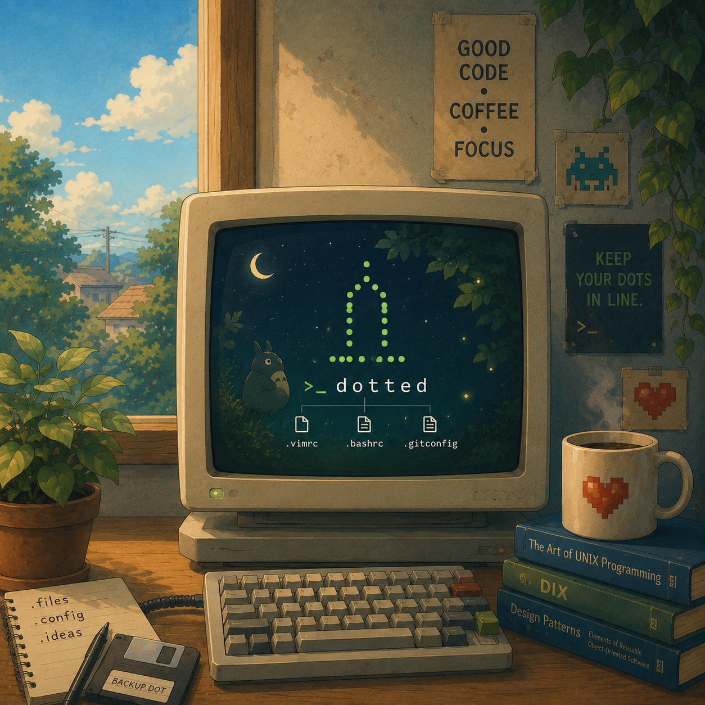

# dotted


All my . files managed in one place using the [GNU Stow](https://www.gnu.org/software/stow/) pattern and an automated installer.
Each configuration lives in its own directory (a "stow package") and is symlinked into `$HOME`, making it easy to manage, version, and reproduce my environment.

This repository acts as a single source of truth, allowing me to sync and bootstrap the same setup across multiple machines by changing and maintaining just one source.

<p align="center">
  
</p>

## Installation

```sh
git clone https://github.com/mo1ein/dotted.git
cd dotted
```

```sh
chmod +x install.sh
./install.sh
```

> [!NOTE]
> Existing dotfiles are automatically backed up before creating symlinks to the new configuration files.

## OS packages

The installer detects your OS and picks the right package manager:

- **macOS** — installs [Homebrew](https://brew.sh/) automatically if it's missing, then installs CLI tools with `brew install` (from `packages-mac.txt`) and GUI apps (Bruno, Ghostty, VLC) with `brew install --cask` (from `casks-mac.txt`).
- **Debian/Ubuntu** — installs packages from `packages.txt` with `apt`.

GNU Stow and Neovim are always installed first — Stow is required to symlink the dotfiles and Neovim for the editor config.

```sh
./install.sh --install-pkgs
```

## Restore backup

```sh
./install.sh --restore
```

easy peasy lemon squeezy!
